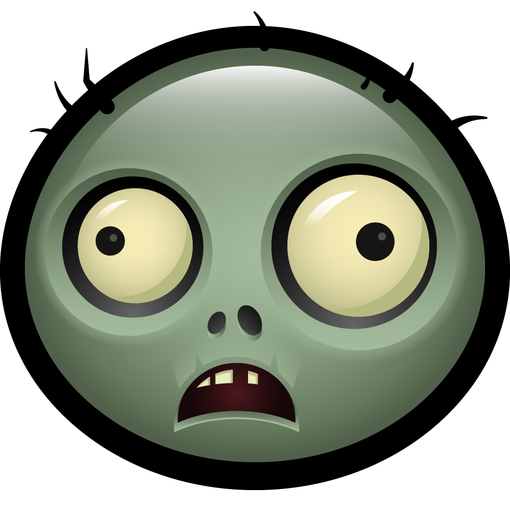
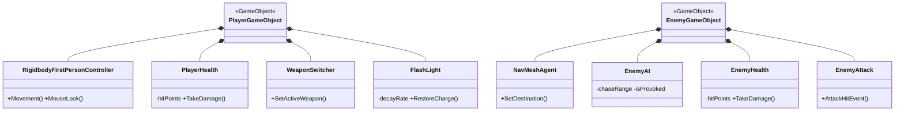
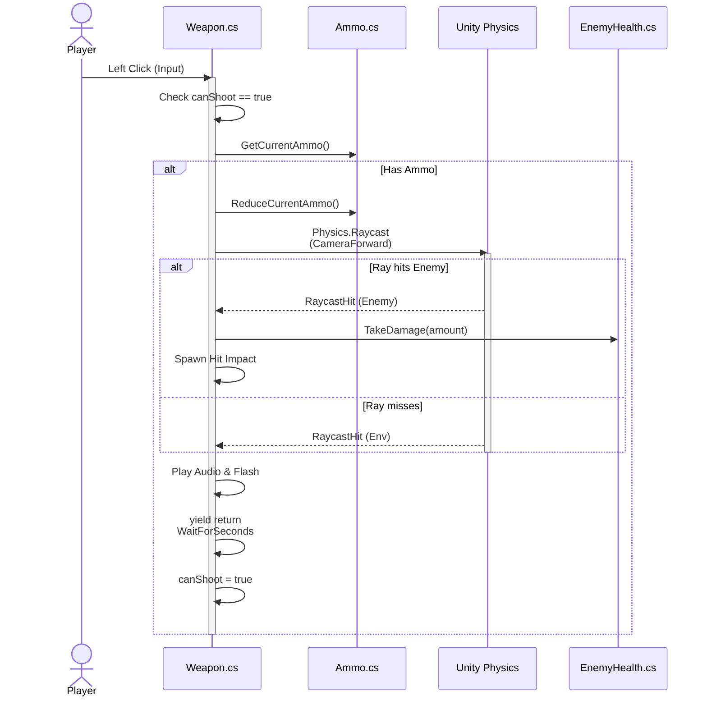
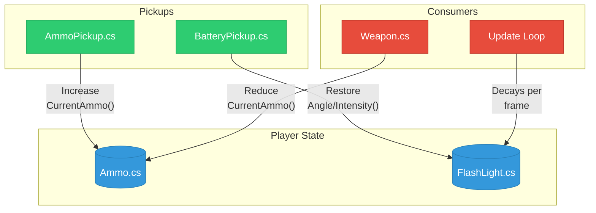
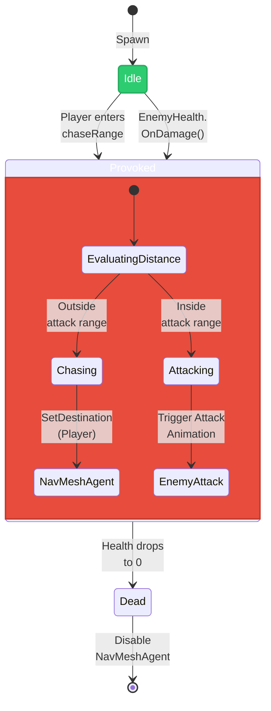
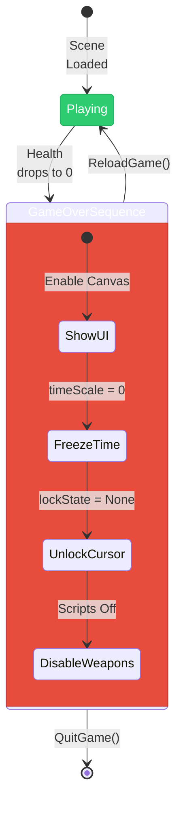
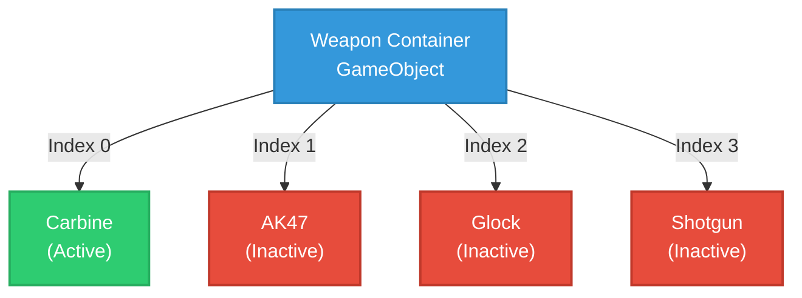

<div align="center">

# Zombie Shooter - A Unity FPS Case Study

**A first-person zombie survival shooter built in Unity, showcasing component-based game architecture, C# gameplay scripting, and Unity's physics/AI/animation systems.**



<br>


</div>

---

> **Project status: Legacy / Archived.** This project was built during my undergraduate years (NIT Trichy) as a hands-on exercise in Unity gameplay programming. It has not been actively maintained since, and is shared primarily as a case study / portfolio reference.

---

## Table of Contents
1. [What This Project Actually Is](#what-this-project-actually-is)
2. [Tech Stack](#tech-stack)
3. [Core Systems - File-by-File Walkthrough](#core-systems--file-by-file-walkthrough)
4. [Design Decisions & Trade-offs](#design-decisions--trade-offs)
5. [Repository Structure](#repository-structure)
6. [Vendored / Third-Party Assets](#vendored--third-party-assets)
7. [Known Limitations & What I'd Do Differently Today](#known-limitations--what-id-do-differently-today)
8. [Running the Project](#running-the-project)
9. [Contributing](#contributing)
10. [License](#license)

---

## What This Project Actually Is

A single-level, first-person zombie shooter: the player moves through a level (`Assets/level1.unity`), fights melee zombie enemies using switchable ranged weapons with per-weapon-type ammo pools, and can pick up ammo/battery resources scattered through the level. Combat is hitscan (`Physics.Raycast`), not projectile-based. Enemies use Unity's `NavMeshAgent` for pathing and a simple two-state (idle/provoked) behavior model driven by distance checks and damage events.

It is intentionally scoped as a **systems-programming exercise**, not a full game - there is one level, no save system, no wave/spawner manager, and no menu flow beyond a game-over/reload screen.

## Tech Stack

| Category | Technology |
|---|---|
| Engine | Unity (Built-in Render Pipeline) |
| Language | C# |
| AI / Navigation | Unity `NavMeshAgent` (`UnityEngine.AI`) |
| UI | TextMesh Pro (`TMPro`) |
| Player Controller | Unity Standard Assets `RigidbodyFirstPersonController` |
| Physics | Unity `Physics.Raycast`, trigger colliders (`OnTriggerEnter`) |
| Shading | ShaderLab + HLSL (custom materials/skybox, ~22% of codebase by GitHub's language stats) |

## Core Systems - File-by-File Walkthrough



### Combat

**`Weapon.cs`** - the firing pipeline. On left-click, if `canShoot` is true, it kicks off a `Shoot()` coroutine that:
1. Checks the current weapon's ammo via `ammoSlot.GetCurrentAmmo(ammoType)`.
2. Fires a `Physics.Raycast` from the camera forward vector out to a configurable `range`.
3. On hit: spawns a hit-impact particle oriented to `hit.normal`, and if the hit object has an `EnemyHealth` component, applies `damage`.
4. Plays gunfire particle + audio, decrements ammo.
5. Yields on `WaitForSeconds(timeBetweenShots)` before resetting `canShoot = true`, which gates the next raycast.

This is a coroutine-gated fire-rate limiter, not a full weapon-state system - there's no reload state, no burst-fire logic, no recoil pattern. It's a clean, minimal implementation of hitscan combat.



**`WeaponSwitcher.cs`** - iterates `transform` children (each weapon is a child GameObject) and toggles `SetActive` based on a `currentWeapon` index, driven by number keys 1–4 or mouse scroll.

**`WeaponZoom.cs`** - right-click toggles a zoom state that adjusts `Camera.fieldOfView` and simultaneously overwrites `RigidbodyFirstPersonController.mouseLook.XSensitivity/YSensitivity` - coupling zoom to look sensitivity so aiming feels less jarring.

### Ammo Economy

**`AmmoTypes.cs`** - a 4-value enum (`CARBINE`, `AK47`, `GLOCK`, `SHOTGUN`) used as a type key across the ammo system.

**`Ammo.cs`** - holds a serialized array of a private nested `AmmoSlot` class (`{ AmmoType ammoType; int ammoAmount; }`), exposed to the Inspector. Public API is `GetCurrentAmmo`, `ReduceCurrentAmmo`, `IncreaseCurrentAmmo`.

**`AmmoPickups.cs`** - on player trigger enter, plays a pickup sound, calls `FindObjectOfType<Ammo>().IncreaseCurrentAmmo(...)`, and destroys itself.



### Enemy AI

**`EnemyAI.cs`** - the most involved script in the project. Each frame: computes `distanceToTarget` to the player, and if not dead:
- If already `isProvoked`, calls `EngageTarget()`, which rotates to face the player (`FaceTarget()` via `Quaternion.Slerp`), then either chases (`NavMeshAgent.SetDestination`) or attacks depending on distance.
- If not yet provoked, checks whether the player has entered `chaseRange` and flips `isProvoked = true`.
- `OnDamage()` is a second, independent trigger into the provoked state, called reactively when the enemy takes damage (see below).
- `EnemeyDie()` disables the `NavMeshAgent` once `EnemyHealth.IsDead()` is true, so a dead enemy stops pathing without needing to destroy the GameObject immediately (animation/ragdoll can still play).
- `OnDrawGizmos()` visualizes `chaseRange` as a wire sphere in the editor - a small but genuine debug-tooling touch.

This is a two-state behavior model (idle → provoked, with provoked branching into chase/attack based on distance) rather than a formal state machine class/enum - worth being precise about in a technical write-up.



**`EnemyHealth.cs`** - `TakeDamage()` calls `BroadcastMessage("OnDamage")` (a reflection-based, string-keyed message dispatch to all components on the GameObject) before applying damage, then tracks death state.

**`EnemyAttack.cs`** - an Animator-event-driven attack: `AttackHitEvent()` is called from within the attack animation clip and applies damage to a cached `PlayerHealth` reference plus triggers a hit reaction.

### Player State

**`PlayerHealth.cs`** - decrements `hitPoints`, updates a TextMeshPro health readout, and calls `DeathHandler.HandleDeath()` at zero HP.

**`DeathHandler.cs`** / **`EndGame.cs`** - both implement the same shutdown sequence independently: enable a game-over `Canvas`, freeze simulation via `Time.timeScale = 0`, unlock and show the cursor, disable player weapon scripts.

**`DisplauDamage.cs`** - a coroutine-driven damage-flash: enables a screen-space `Canvas`, plays a hit sound, waits `impactTime` seconds, then disables it and stops the audio. Same coroutine-based timing pattern as `Weapon.cs`.

**`FlashLight.cs`** - models the flashlight as a decaying resource: every frame reduces `Light.spotAngle` and `Light.intensity` by fixed per-second rates until a floor angle is hit, with public methods to restore charge.

**`BatteryPickups.cs`** - on player trigger, calls into `FlashLight` on the player's children to restore angle/intensity, mirroring the same pickup pattern as `AmmoPickups.cs`.

**`ScreenLoader.cs`** - `ReloadGame()` reloads scene index 0 and resets `Time.timeScale = 1` (undoing the freeze from death/end-game); `QuitGame()` calls `Application.Quit()`.

## Design Decisions & Trade-offs

Written as an honest reflection on choices actually present in the code, framing deliberate trade-offs made for simplicity and performance appropriate to the project's scope.

### Architectural Choices & Optimizations

**Hitscan via Raycast instead of physical projectiles (`Weapon.cs`)**
The `ProcessRayCast()` method applies damage directly to an `EnemyHealth` component via `Physics.Raycast` - no bullet Rigidbody is ever instantiated. This avoids the overhead of spawning a GameObject per shot and simulating bullet travel, at the cost of no travel-time/ballistics realism - an appropriate trade-off for a hitscan-style shooter.

**Distance check gates expensive AI behavior (`EnemyAI.cs`)**
The AI computes `Vector3.Distance` every frame; only when the player is within `chaseRange` does the script allow `NavMeshAgent.SetDestination()` to execute. `Vector3.Distance` is a cheap arithmetic check, so gating the more expensive NavMesh pathing call behind it keeps idle enemies cheap.

**Game-over handled by component mutation, not scene reloading (`DeathHandler.cs`)**
`HandleDeath()` freezes the game by setting `Time.timeScale = 0`, unlocks the cursor, and disables `WeaponSwitcher` and `Weapon`. It intentionally does not call `SceneManager.LoadScene`. Freezing in place avoids the cost/latency of a reload and preserves the scene for a "game over" screen overlay.



**Weapon switching via local transform hierarchy (`WeaponSwitcher.cs`)**
The inventory iterates over its `transform` children and toggles `SetActive` based on an index. With a small, fixed number of weapon slots (at most 4 children), a simple linear scan over a bounded array is simpler and just as fast as a dictionary lookup.



### Known Anti-Patterns & Refactoring Opportunities

**Coroutines for timed gates (`Weapon.cs`, `DisplauDamage.cs`) vs. a manual `Update()` timer.**
Both scripts use `IEnumerator` + `WaitForSeconds` to gate a timed window (fire-rate cooldown, damage-flash duration). While this reads more linearly, it incurs a small per-call allocation from `new WaitForSeconds(...)`; a cached timer field would avoid that allocation entirely.

**`BroadcastMessage` in `EnemyHealth.TakeDamage()` vs. a direct method call or C# event.**
`BroadcastMessage("OnDamage")` dispatches a string-keyed message to every component on the GameObject via reflection. This works, but it's slower than a direct call (reflection lookup every invocation) and loses compile-time safety on the method name.

**Duplicated shutdown logic in `DeathHandler.cs` and `EndGame.cs`.**
Both scripts independently implement the exact same five-step sequence (enable canvas, freeze time, unlock cursor, disable weapon scripts). This is the clearest refactor candidate in the codebase - extract to a shared `GameOverController`.

**`FindObjectOfType` for cross-script references vs. cached references.**
Several scripts locate collaborators at runtime via `FindObjectOfType<T>()` rather than caching a reference once in `Start()`. While simple and effective for a single small level with sparse calls, it does not scale to larger scenes with many objects of the same type.

**Distance-based two-state AI vs. a full scripted FSM.**
Enemy behavior is governed by a bool (`isProvoked`) and distance comparisons, keeping logic short for a small enemy roster. However, this does not scale cleanly to more complex behaviors (e.g., flee, flank, group coordination) without introducing a proper state machine.

## Repository Structure

```text
Assets/
├── Game/                 # Original gameplay code - see walkthrough above.
│                          # Weapon.cs, Ammo.cs, AmmoTypes.cs, AmmoPickups.cs,
│                          # EnemyAI.cs, EnemyHealth.cs, EnemyAttack.cs,
│                          # PlayerHealth.cs, DeathHandler.cs, EndGame.cs,
│                          # WeaponSwitcher.cs, WeaponZoom.cs, FlashLight.cs,
│                          # BatteryPickups.cs, DisplauDamage.cs, ScreenLoader.cs
│                          # + associated prefabs (Enemy, GAME, Canvas, Pickups,
│                          # bullet packs, bloodSplatter) and animations.
├── Zombie/                # Third-party zombie character pack (FBX models,
│                          # animations, materials, textures) + a
│                          # ScenePrefabs.unity staging scene.
├── Scenes/                # Contains the project's actual level (level1.unity
│                          # lives at Assets/level1.unity directly).
├── Standard Assets/       # Unity's official Standard Assets package -
│                          # source of RigidbodyFirstPersonController.
├── Pbr Weapons v1/        # Third-party PBR weapon model pack.
├── Ammunition pack (demo)/# Third-party ammo pickup asset pack (models,
│                          # materials, a demo scene).
├── Starfield Skybox/      # Third-party skybox asset pack + demo scene/textures.
├── TextMesh Pro/          # Unity's official TextMesh Pro package (UI text
│                          # rendering used by ammo/health HUD).
├── NikolayFedorov/        # Third-party asset pack.
├── Free asset/            # Third-party free asset pack.
├── AssetStoreOriginals/   # Unpacked Asset Store originals.
├── materials/, prefabs/   # Project-level material and prefab overrides.
└── Zombie-PVZ-icon.png    # Project icon (used as this README's banner).
```

## Vendored / Third-Party Assets

In the interest of transparency, the following are **not original work** - they are Unity Asset Store packages or free asset packs integrated into the project, not authored by me:

- `Assets/Zombie/` - zombie character models/animations
- `Assets/Pbr Weapons v1/` - weapon models
- `Assets/Ammunition pack (demo)/` - ammo pickup models
- `Assets/Starfield Skybox/` - skybox
- `Assets/NikolayFedorov/`, `Assets/Free asset/`, `Assets/AssetStoreOriginals/` - supplementary art assets
- `Assets/Standard Assets/` - Unity's official first-person controller package
- `Assets/TextMesh Pro/` - Unity's official UI text package

My original contribution is the gameplay logic in `Assets/Game/` (all C# scripts listed above), the wiring of these systems together in the level, and the integration of the third-party art/character assets.

## Known Limitations & What I'd Do Differently Today

Being direct about this rather than hiding it:

- **No automated tests.** All logic was hand-verified in the Unity Editor Play mode - there's no EditMode/PlayMode test suite.
- **`BroadcastMessage` usage** in `EnemyHealth.cs` is a known anti-pattern (see trade-offs section) - would replace with a direct call or event.
- **Duplicated pause/game-over logic** between `DeathHandler.cs` and `EndGame.cs` - would extract to a shared controller.
- **Inconsistent reference-resolution strategy** (`FindObjectOfType` vs. cached fields) across pickup/attack scripts - would standardize on cached references or a lightweight service locator.
- **No object pooling** for bullet impact effects or blood splatter prefabs - `Weapon.cs` calls `Instantiate`/`Destroy` per shot, which is fine at this project's scale but would need pooling under heavier fire rates.
- **Large binary assets committed directly to Git** (multi-MB `.unity`/`.asset`/`.png` files) rather than via Git LFS - a consequence of when this was built, not current practice.
- **Single hardcoded level**, no wave/spawn manager, no save system - scoped as a scripting exercise rather than a full game loop.

## Running the Project

This is a legacy Unity project and has not been verified against current Unity LTS releases.

1. Install a Unity Editor version compatible with this project via Unity Hub (check `ProjectSettings/ProjectVersion.txt` in this repo for the exact version this was authored against).
2. Clone the repository and add it via Unity Hub → **Add project from disk**.
3. Allow time for asset reimport - the project includes several large vendored texture/model packs.
4. Open `Assets/level1.unity` and press Play.

No guarantees are made about a clean import on first open, given the project's age - see [Known Limitations](#known-limitations--what-id-do-differently-today).

## Contributing

This is a legacy, archived solo project built for educational purposes. There is no active development, community, or support, and pull requests or issues will generally not be monitored.

## License

MIT - see [LICENSE](LICENSE). Third-party assets listed under [Vendored / Third-Party Assets](#vendored--third-party-assets) retain their original Asset Store / publisher licenses and are not covered by this repository's MIT license.
